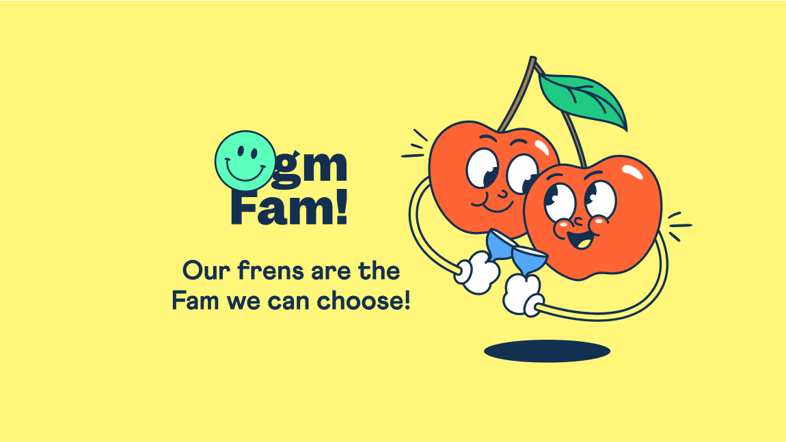

# 

As seen in [ETHOnline 2023 Async hackathon](https://ethglobal.com/showcase/gm-fam-ayigu)

Migrate your NFT community from the original one accompanied by your Frens, wrapping the NFTs into a new diverged Smart Contract. Because with "gm Fam!", we believe that the best communities are the ones we choose to build together!

## Project Description
In the web3 world, many degens and users were excited about NFT Collections that represented community vibes, goals, and plans for the future. But as time went on, whether in a few weeks or after several years, about 90% of these NFT communities lost their activity and traction. This left many NFT holders feeling stuck and frustrated because these collections were either controlled by the founders or depended too much on the entire community of holders.

This decrease in activity often happened because founders lost interest when they didn't make enough money, or there was less activity from the community. Sometimes, there were disagreements inside the community. As things slowed down, some community members started selling their NFTs.

To fix this problem, we came up with "gm Fam!". It's a way for dedicated community members to start a new NFT Collection using the original NFTs (this is called "wrapping"). This new collection stays connected to the original but has new rules, goals, and directions.

Our easy-to-use dApp lets any NFT holder or community group (called a SAFE) set up a wrapped NFT Smart Contract. This is for community members who want a new direction. Features include choosing new fees for creators, making a list of addresses or tokenIDs that can join, setting a new price for MINT, and choosing metadata. You can see how it works in the attached screens.

So, what's the result? A new Smart Contract that lets NFT holders move to their own new ''gm Fam!' collection. New users just go to the project's website, give permission to the new Smart Contract to handle their NFTs, and then make a move with one transaction.

Here are some questions we find interesting:

1. What happens when you sell or give away the new NFT? The new NFT works like any other NFT because it follows the ERC-721 standard. If someone else gets it, they can choose to go back to the original collection. If they do, the token in the new collection is destroyed.

2. How can you go back to the original collection? Users can use a simple feature: the new NFT is destroyed, and they get back ownership of the original NFT from the original Smart Contract.

3. Why is this a good idea? Our method is flexible. This means developers can add more features to it, like connecting to other systems, working with DAOs, and more.
